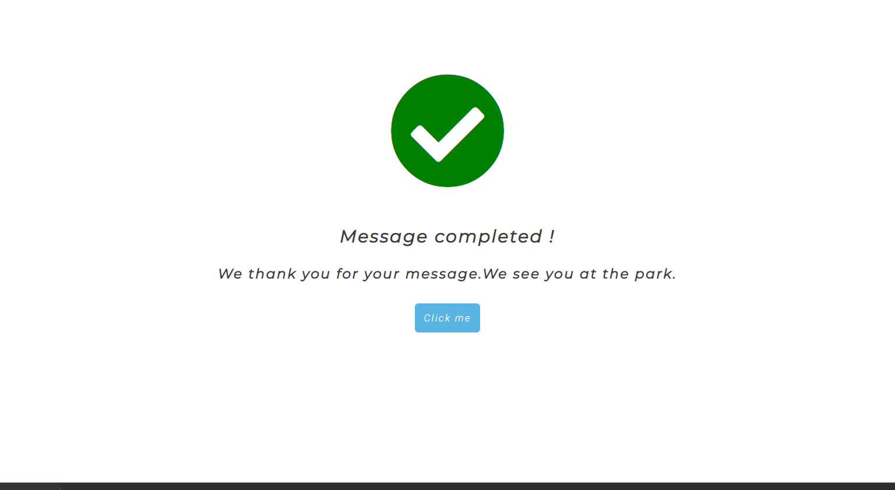
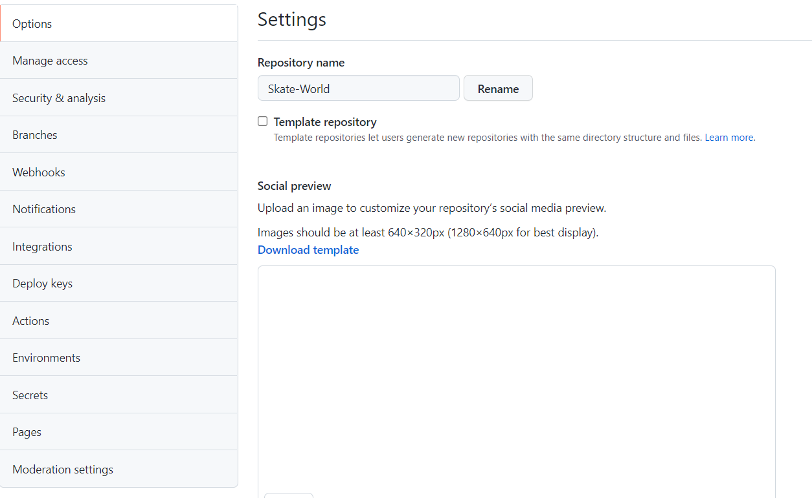

# Skate World

## By Patrick Alexander Lucas Van Der Flier

### [Check Skate World](https://vanderpatrick.github.io/Skate-World/index.html)
### [Check my Repository](https://github.com/vanderpatrick/Skate-World)

# Skate World :

### Skate World was developed by me as my first Full Stack Web Development project with Code Institute.

# Reason :
Skate World is a website to unite the skate community all around the world in a fast and direct approach, presenting all of the team specialized with differents Skate styles so de user can have a piece of brief information about the teacher's team.

# The user Experience (UX)

##  Audience : 

- People who wish to learn how to skate.
- Skaters that wish to improve their skill set.
- skaters who wish to learn a different skate style.

## User Report : 

- first experience

    1. As a user I would like to learn about the school with ease.
    2. As a user I would like easy navigation.
    3. As a user I would like to learn about the school team.

- Second experience

    1. I would want to double-check the team info.
    2. I would want to see the feedback with ease.
    3. I would want to double-check the contact information.

- As a developer    
    
    1. I want to make the site easy to navigate.
    2. I want to make the site direct. 
    3. I want to be informative.

# Features :

The Features were designed to distinguish each area with ease so the user can explore the site instinctively.

- Navigation bar
    - The navigation bar is featured on all 3 pages being responsive for big medium and small devices.
    - It consists of 4 clickable links that redirect in a new tab to the other pages. 
    - The Header act as a link to the home page.
    - as it shrinks the navigations links (Home, Team, Contact) turn into a burger-styled menu.

 

- Landing page
    - the landing page includes an image to give an impactful community feeling.
    - it consists of an overlay for easy contact with the school.

- School information
    - The school info section was designed to be as direct and efficient as possible.
    - It's composed of three sections to quickly give info about the school and its goals.

- Feedback section
    - This section gives the user experience from students that have enrolled with the school.
    - This is a 2 column grid that highlights the best feedbacks.

- Footer
    - footer consists of social media links, where the user can quickly check the school's daily routine.

- Team
    - The team section is a three-column grid with the.
purpose to quickly send information about the teachers to the user.
    - The section gives a brief info about the teacher with a photo for identification.

- Contact us

  - this section is a form made for the user to send questions that they have to the school team.
  

- After page
  - This page redirects you to the home page with a clickable button.
  

# Testing :

Since this is an HTML and CSS project my main concern was the responsiveness of the project while taking into account the validation of the HTML and CSS.

 - The project was built with a desktop approach, with this in mind I never thought how stressful it was to make everything responsive.

 - It was used a lot of media queries to respond not only to general screen sizes but also some for specific sizes.

 # Test Validators :

 ## [HTML Validator](https://validator.w3.org/nu/?doc=https%3A%2F%2Fvanderpatrick.github.io%2FSkate-World%2F)

All Html pages have been tested and passed with success.

 ## [Jigsaw CSS Validator](https://jigsaw.w3.org/css-validator/validator?uri=https%3A%2F%2Fvanderpatrick.github.io%2FSkate-World%2F&profile=css3svg&usermedium=all&warning=1&vextwarning=&lang=en)

The CSS file has been tested and passed with success.

# Deployment :
 ## This project was deployed to GitHub. Instructions on how to deploy bellow :
  - In the GitHub repository go to settings.
  

  - In the settings tab click the page button.
  

  - Change the none button to the main.
  
  
  - Click save and then check your link URL.
  

  # External Features :
  ### In the links below, you will find all the icons and images used in the project. (except the team profile photos that were donated by my personal friends)

- [Google Fonts](https://fonts.google.com/)
  - Was used to select the font combination for this project.
- [Font Awesome](https://fontawesome.com/)
  - Was used to select the icons used in this project.  
- [Pexels](https://www.pexels.com/)
  - Was used to select images used in this project. 

  # Credits :
 1. [Web Dev Simplified](https://youtu.be/At4B7A4GOPg)
  - Web dev helped me a lot with my NavBar struggles and with overall problems regarding CSS and HTML.

 2. [Code info](https://youtu.be/-1oE7CWweIE)
  - this code info video was a stepping stone for my contact page.
  
 3.  [Code Institute](https://codeinstitute.net/)
  - Code Institute has a practical and direct teaching system that helped me get to this point.

  ## Special thanks 
  I would like to thank everyone who helped me with this project.

- My mentor.
- All my friends,
which helped me out with profile photos for the team section.
- Armandinho for all the support and advice.
- Code Institute for giving the best support to develop this project.