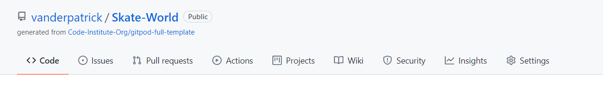
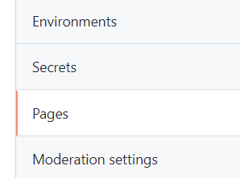
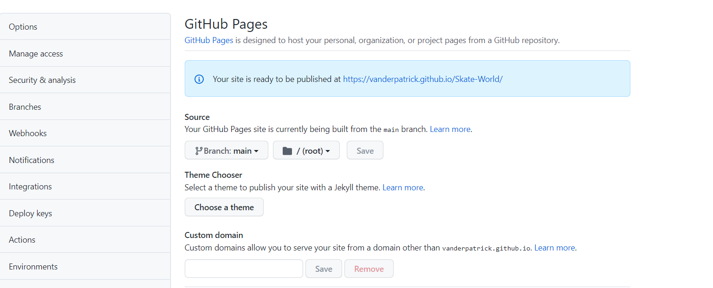

# Skate World

## By Patrick Alexander Lucas Van Der Flier

### [Check Skate World](https://vanderpatrick.github.io/Skate-World/index.html)
### [Check my Repository](https://github.com/vanderpatrick/Skate-World)

# Skate World :

### Skate World was developt by me as my first Full Stack Web Development project with Code Institute.

# Reason :
Skate World is a website with the goal of uniting the skate community all around the world in a fast and direct approach, presenting all of the team specialized with differents Skate styles so de user can have a breif information about the teachers team.

# The user Experience (UX)

##  Audience : 

- People who wish to learn how to skate.
- Skaters that wish to improve their skill set.
- skaters who wish to learn a diffrent skate style.

## User Report : 

- first experience

    1. As an user i would like to learn about the school with ease.
    2. As an user i would like an easy navigation.
    3. As an user i would like to learn about the school team.

- Second experience

    1. I would want to double check the team info.
    2. I would want to see the feedback with ease.
    3. i would want to double check the contact infromation.

- As a developer    
    
    1. I want to make the site easy to navigate.
    2. I want to make the site direct. 
    3. I want to be informative.

# Features :

The Features were design to distinguish each area with easy so the user can explore the site instinctively

- Navigation bar
    - The navigation bar is featured in all 3 pages being responsive for big medium and small devices.
    - It consists 4 clickable links that redirect in a new tab the other pages. 
    - The Header act as an link to the home page.
    - as it skrinks the navigations links (Home, Team, Contact) turn into a burger styled menu.

 

- Landing page
    - the landing page includes an image to give a impactfull community felling.
    - it consists an overlay for ease contact with the school.

- School information
    - The school info section was desing to be as direct an efficient as possible
    - Its composed by three sections to quickly give info about the school and its goals

- Feedback section
    - This section gives the user experience from students that have enrolled with the school
    - This is a 2 column grid that highlights the best feedbacks

- Footer
    - footer consists of social media links, where the user can quickly check the school daily routine

- Team
    - The team section is a three column grid with te propuse to quickly send information about the teachers to the user
    - The section gives a brief info about the teacher with a photo for identification

# Testing :

Since this is a HTML and CSS project my main concearn was the responsivenes of the project while taking in account the validation of the html and css.

 - The project was build with a desktop approuch, with this in mind i never thought how stresful it was to make everything responsive.

 - It was used a lot of media quieries to responde not only to general screen sizes but also some for especific sizes.

 # Test Validators :

 ## [HTML Validator](https://validator.w3.org/nu/?doc=https%3A%2F%2Fvanderpatrick.github.io%2FSkate-World%2F)

All Html pages have been tested and passed with success.

 ## [Jigsaw CSS Validator](https://jigsaw.w3.org/css-validator/validator?uri=https%3A%2F%2Fvanderpatrick.github.io%2FSkate-World%2F&profile=css3svg&usermedium=all&warning=1&vextwarning=&lang=en)

The CSS file have been tested amd passed with success.

# Deployment :
 ## This project was deployed to GitHub. Instructions how to deploy bellow :
  - In the GitHub repository go to settings
  
  - In the settings tab click the page button
  
  - Change the none button to main
  
  - Click save and then check your link url
  

  # Credits :
 1. [Web Dev Simplified](https://youtu.be/At4B7A4GOPg)
  - Web dev helped me a lot with my NavBar struggles and with overall problems regarding css and html.

 2. [Code info](https://youtu.be/-1oE7CWweIE)
  - this code info video was a steping stone for my contact page
  
 3.  [Code Institute](https://codeinstitute.net/)
  - Code Institute has a practical and direct teaching system that helped me get to this point

  ## Special thanks 

  

    

    

